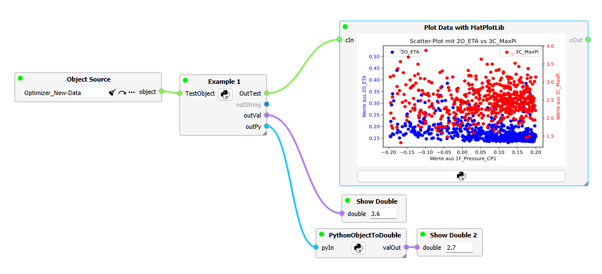

# Python nodes for Gtlab-Intelligraph

This GTlab module allows to run python scripts in intelligraph workflows.
  
  

## Features ⭐
  - 🐍 Run python scripts as intelligraph nodes
  - 🔌Custom input / output ports to pass python data
  - 📊Matplotlib interface to draw plots directly in the node

    
 ## License

The largest portion of the code is licensed under the `Apache 2.0 License`.

Smaller thirdparty party code part of code base uses other permissive licenses, such as the
`BSD` and `MIT` licenses. Please review the directory [LICENSES](https://github.com/dlr-gtlab/python-node-module/tree/master/LICENSES) and [.reuse](https://github.com/dlr-gtlab/python-module/tree/master/.reuse)
for a full overview on all licensed used.


## Compiling from Source

### Prerequisites

A working GTlab installation is required. This includes GTlab and the GTlab Logging library.
In addition the python module and the intelligraph-module of the GTlab eco-system are 
required including thier dependencies.

| Library              |  Version  | Bundled | Where to get                                     |
| -------------------- | --------- | ------- | -------------------------------------------------|
| Qt                   |  5.15.x   | No      | https://download.qt.io/official_releases/qt/     |
| GTlab Core + Logging |  >= 2.0   | No      | https://github.com/dlr-gtlab/gtlab-core          |
| Python               |  3.9.x    | No      | https://www.python.org/downloads/                |
| PythonQt             | >= 3.5.0  | Yes     | https://github.com/MeVisLab/pythonqt             |
| intelligraph-module  | >= 0.12.0 | No      | https://github.com/dlr-gtlab/intelligraph-module |
| python-module        | >= v1.6.1 | No      | https://github.com/dlr-gtlab/python-module       |

### Building

The python node module requires a recent `CMake` (>3.15) to build. The configuration and build process is
similar to other CMake builds:

```
cmake -S . -B build_dir -DQt5_DIR=<path/to/cmake/Qt5> -DCMAKE_PREFIX_PATH=<path/to/gtlab_install> -DCMAKE_INSTALL_PREFIX=<path/to/gtlab_install>
cmake --build build_dir
cmake --build build_dir --target install
```

## FAQ
### Why can I not see my plot in the node?
To display a plot in the node, there are a few things to consider:
 - The script in the Python node has an interface for matplotlib. Only plots created with it can be displayed. The scripts must end with the show() function of the plot object.
 - The node has a "Plot enabled" property. This must be set to true.
 - The plot can only be displayed if the node has a certain size. If in doubt, you can check this by dragging the node larger (in the bottom right-hand corner of the node).
 
### How are python objects exchanged between the nodes?
Connections of the nodes' ports can be used for data exchange between the nodes. Only ports of the same type can be connected to each other.
The Python node can process all available types on the input side.
Many provided data types have a value() function or similar to make the data of the connection accessible in the Python script. This is also demonstrated in the attached examples.
A few generic data types are enabled on the output side. 
However, the intelli::ByteArrayData data type can be used to pass Python objects directly. 
In this case, the Python functionality "pickl" is used. This method is therefore restricted to data that [is pickl-capable.] (https://docs.python.org/3/library/pickle.html#what-can-be-pickled-and-unpickled)